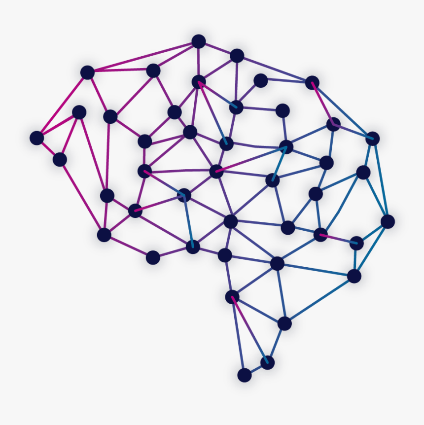

  
  <h1 align="center">AI Math Roadmap</h1>
  
Your no-nonsense guide to the Math used in Artificial Intelligence

  

      
      

  

   

# Overview 
<blockquote>
A person working in the field of AI who doesn’t know math is like a politician who doesn’t know how to persuade. Both have an inescapable area to work upon!
</blockquote>

A week back, I wrote an article on [How to Get into Data Science in 2021](https://jasmcaus.medium.com) and since then I've received several emails from people all over the world asking ***just how much*** math is required in Data Science. 

I won't lie: It's **a lot of math**. 

And this is one of the reasons that puts off many beginners. After much research and talks with several veterans in the field, I've compiled this no-nonsense guide that covers **all of the fundamentals of the math you'll need to know**. The concepts mentioned below are usually covered over several semesters in college, but I've boiled them down to the core principles that you can focus on. 

This guide is an absolute life-saver for beginners, so you can study the topics that matter most, and an even better resource for practitioners such as myself who require a quick breeze-through on these concepts.

**Note**: You don't need to know all of the concepts (below) in order to get your first job in Data Science. All you need is a *firm grasp* of the fundamentals. Focus on those and consolidate them. 

# Table of Contents 

## 1. Algebra
Knowledge of algebra is perhaps fundamental to math in general. Besides mathematical operations like addition, subtraction, multiplication and division, you'll need to know the following:

- [Exponents](http://www.mclph.umn.edu/mathrefresh/exponents.html)
- [Radicals](https://tutorial.math.lamar.edu/classes/alg/Radicals.aspx)
- [Factorials](https://www.youtube.com/watch?v=pGg40oiQsUk&feature=youtu.be)
- [Summations](https://www.youtube.com/watch?v=LDfaYXXAcHY&feature=youtu.be)
- [Scientific Notations](https://www.khanacademy.org/math/pre-algebra/pre-algebra-exponents-radicals)

## 2. Linear Algebra
Linear Algebra is the primary mathematical computation tool in Artificial Intelligence and many areas of Science and Engineering. In this, 4 primary mathematical objects and their properties need to be understood:
- [Scalars](http://www.sciencebits.com/vector_algebra) - a single number (can be real or natural).
- [Vectors](http://www.sciencebits.com/vector_algebra) - a list of numbers, arranged in order. Consider them as points in space with each element representing the coordinate along an axis.
- [Matrices](https://www.mathsisfun.com/algebra/matrix-introduction.html) - a 2-D array of numbers where each number is identified by 2 indices.
- [Tensors](https://mathworld.wolfram.com/Tensor.html) - an N-D array of numbers (N>2), arranged on a regular grid with N-axes. Important in Machine Learning, Deep Learning and [Computer Vision](https://github.com/jasmcaus/caer)
- [Eigenvectors & Eigenvalues](https://www.mathsisfun.com/algebra/eigenvalue.html) - special vectors and their corresponding scalar quantity. Understand the significance and how to find them.
- [Singular Value Decomposition](https://web.mit.edu/be.400/www/SVD/Singular_Value_Decomposition.htm) - factorization of a matrix into 3 matrices. Understand the properties and applications. 
- [Principal Component Analysis (PCA)](https://royalsocietypublishing.org/doi/10.1098/rsta.2015.0202) - understand the significance, properties, and applications.

Properties such as the [Dot product](https://betterexplained.com/articles/vector-calculus-understanding-the-dot-product/), [Vector product](http://hyperphysics.phy-astr.gsu.edu/hbase/vvec.html) and the [Hadamard product](https://handwiki.org/wiki/Hadamard_product_(matrices)) are useful to know as well.

## 3. Calculus
Calculus deals with changes in parameters, functions, errors and approximations. Working knowledge of multi-dimensional calculus is imperative in Data Science. The following are the most important concepts (albeit non-exhaustive) in Calculus:
- [Derivatives](https://www.mathsisfun.com/calculus/derivatives-introduction.html) - rules (addition, product, chain rule etc), hyperbolic derivatives (tanh, cosh etc) and partial derivatives.
- [Vector/Matrix Calculus](http://www.personal.rdg.ac.uk/~sis01xh/teaching/CY4C9/ANN3.pdf) - different derivative operators (Gradient, Jacobian, Hessian and Laplacian)
- [Gradient Algorithms](https://towardsdatascience.com/gradient-descent-algorithm-and-its-variants-10f652806a3) - local/global maxima & minima, saddle points, convex functions, batches & mini-batches, stochastic gradient descent, and performance comparison.

## 4. Statistics & Probability
- [Basic Statistics](https://www.dummies.com/education/math/statistics/statistics-for-dummies-cheat-sheet/) - Mean, median, mode, variance, covariance etc
- [Basic rules in probability](http://www.milefoot.com/math/stat/prob-rules.htm) - events (dependent & independent), sample spaces, conditional probability.
- [Random variables](https://www.khanacademy.org/math/statistics-probability/random-variables-stats-library) - continuous & discrete, expectation, variance, distributions (joint & conditional).
- [Bayes' Theorem](https://blogs.scientificamerican.com/cross-check/bayes-s-theorem-what-s-the-big-deal/) - calculates validity of beliefs. Bayesian software helps machines recognize patterns and make decisions.
- [Maximum Likelihood Estimation (MLE)](https://towardsdatascience.com/probability-concepts-explained-maximum-likelihood-estimation-c7b4342fdbb1) - parameter estimation. Requires knowledge of fundamental probability concepts (joint probability and independence of events).
- [Common Distributions](https://www.stat.tamu.edu/~twehrly/611/distab.pdf) - binomial, poisson, bernoulli, gaussian, exponential.

## 5. Information Theory
An important field that has made significant contributions to AI and Deep Learning, and is yet unknown to many. It can be thought of as an amalgamation of calculus, statistics and probability. 
- [Entropy](https://mathoverflow.net/questions/146463/what-is-entropy-really) - also called Shannon Entropy. Used to measure the uncertainty of in an experiment. 
- [Cross-Entropy](https://machinelearningmastery.com/cross-entropy-for-machine-learning) - compares two probability distrubutions & tells us how similar they are.
- [Kullback Leibler Divergence](https://www.countbayesie.com/blog/2017/5/9/kullback-leibler-divergence-explained) - another measure of how similar two probability distrubutions are.
- [Viterbi Algorithm](https://www.cis.upenn.edu/~cis262/notes/Example-Viterbi-DNA.pdf) - widely used in Natural Language Processing (NLP) & Speech
- [Encoder-Decoder](https://hackernoon.com/information-theory-of-neural-networks-c96a0f0a8d9) - used in Machine Translation RNNs & other models.

--------------------------------------------------------------------------------

In Artificial Intelligence, maths is very important. Without it, it's comparable to a human body without a soul. You can treat the mathematical concepts as a pay-as-you-go: whenever a foreign concept pops up, grab it and devour it! The guide above presents a minimal, yet comprehensive, resource to understand any kind of topic or concept in AI.

Good luck!

# Contributing

If you think this roadmap can be improved, please do open a PR with any updates and submit any issues. We will continue to improve this, so you might want to consider watching/starring this repository to revisit it in the future.

> Have a look at the [contribution docs](./CONTRIBUTING.md) for how to update any of the roadmaps

* Open a pull request with improvements
* Discuss ideas in issues
* Spread the word
* Reach out with any feedback

# Credits
This roadmap was created by [Jason Dsouza](https://github.com/jasmcaus) and made publically available under the MIT License. 